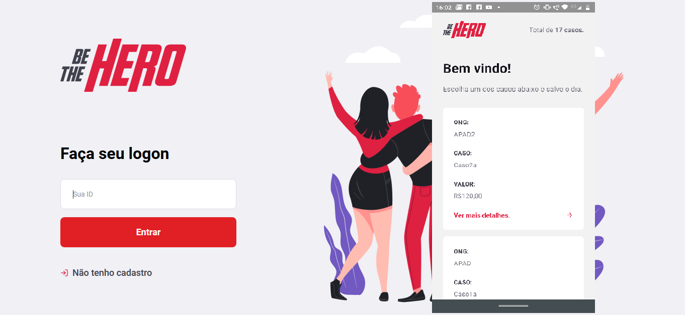

# Be The Hero

O Be The Hero é um projeto que visa conectar entidade que precisam de apoio financeiro com pessoas dispostas a ajudar.

## Como Obter o Projeto

- Faça um fork desse repositório;
- Cria uma branch com a sua feature: `git checkout -b minha-feature`;
- Faça commit das suas alterações: `git commit -m 'feat: Minha nova feature'`;
- Faça push para a sua branch: `git push origin minha-feature`.

Depois que o merge da sua pull request for feito, você pode deletar a sua branch.

### Pré-requisitos

Conhecimento de programação(ES6, HTML, CSS) e uso das stack´s NodeJS, ReackJS, React Native

## Validação e testes

- [Celebrate](https://github.com/arb/celebrate)
- [Jest](https://github.com/facebook/jest)

  

## Tecnologias

- [Node.js](https://nodejs.org/en/)
- [React](https://reactjs.org)
- [React Native](https://facebook.github.io/react-native/)
- [Expo](https://expo.io/)

## Autor

* **Jeferson Nascimento** - *Initial work* - [calljef](https://github.com/calljef)

## Licensa

Esse projeto está sob a licença MIT. Veja o arquivo [LICENSE](LICENSE.md) para mais detalhes.

## Agradecimentos

* Rocketseat pela iniciativa
* Comunidade Rocketseat pela ajuda
* Ao ecossistema React e React Native
